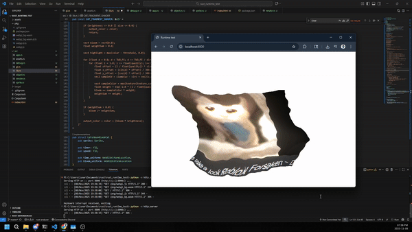

# WebGL Rust Runtime

This is a test so don't take it seriously...
Any feedback is helpful!!!

I'm still learning Rust and this is part of a bigger idea I have (why it's web browser only).

## Build Instructions

- Install [Rust](https://rust-lang.org/) and the [rustup](https://rustup.rs/) installer
- Add the web assembly target: `rustup target add wasm32-unknown-unknown`
- Install the wasm packer: `cargo install wasm-pack`
- Run `wasm-pack build --target web` to build (exports to pkg/)

## Serve Instructions
But how do I see it????

- Install the [Python](https://www.python.org/downloads/) interpreter and runtime
- Run `python -m http.server` to serve to localhost
- Go to your browser and go to `localhost:8000`
- Alternatively you can use [npm](https://www.npmjs.com/) with [http-server](https://www.npmjs.com/package/http-server)